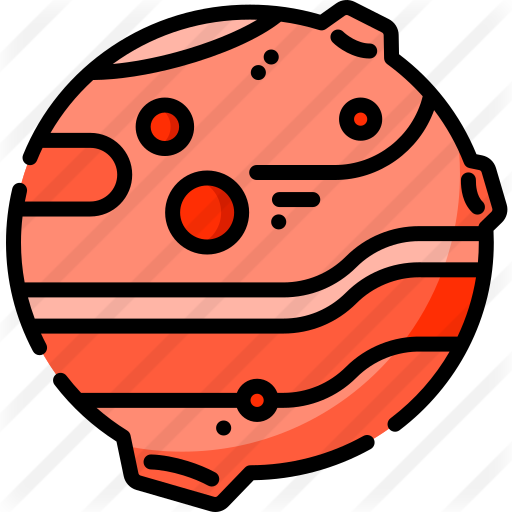
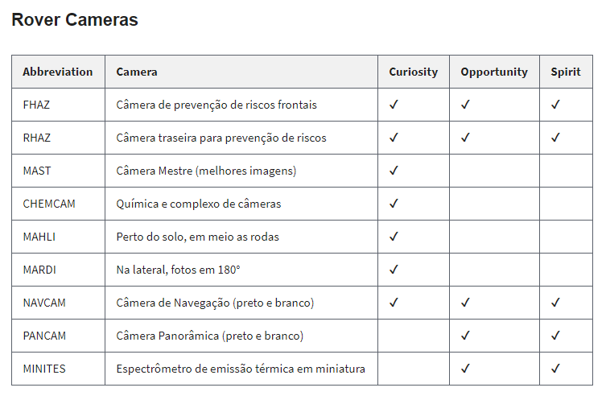

<h1 align="center">
    
</h1>

<h2 align="center">
  Mars Rover App
</h2>

<p align="center">
  <a href="#api-em-node.js">Api em Node.js</a>&nbsp;&nbsp;|&nbsp;&nbsp;
  <a href="#frontend" style="color: #707070;">Frontend em Vue</a>&nbsp;&nbsp;&nbsp;
</p>

<br>

---

## Api em Node.js

---

> Está API utiliza dados da [Mars Photo Api](https://github.com/chrisccerami/mars-photo-api).<br> A qual distrubui dados de viagens e imagens do robô Rover via Rest.

---

### 🛸 Tecnologias utilizadas:

- [Node.js](https://nodejs.org/en/)
- [TypeScript](https://www.typescriptlang.org/)
- [MongoDB](https://www.mongodb.com/2)
- [Mongoose](https://mongoosejs.com/)
- [Express](https://expressjs.com/pt-br/)
- [Celebrate](https://www.npmjs.com/package/celebrate)
- [Axios](https://github.com/axios/axios)

---

### 🔧 Instalação

1. Certifique primeiramente de que possui o Node e o Npm instalado em seu computador.
2. Acesse a pasta `/backend` e rode o comando `npm install`
3. Instale o typescript e o ts-node globalmente: `npm install -g ts-node typescript`
4. Na raiz crie um arquivo com o nome de `.env` e cole o conteúdo do arquivo `.env.example`
5. Para a variável de ambiente `CONNECTION` insira uma conexão com um banco de dados [mongodb](https://www.mongodb.com/2)
   <br><br>

---

### 🔌 Rodar o Projeto

> Após realizar as configurações acima, rode o comando `npm run start`

<br>

---

### 🌌 Rotas para sincronização de dados

---

[]=== **AUTENTICAÇÃO** ===[]
<br>
<br>

> Cadastrar Usuário

```javascript
const route = "/auth/register";
const method = "POST";

const reqBody = {
  email: "email123@exemplo.com",
  password: "password",
  username: "adjonata"
};
```

> Entrar como Usuário

```javascript
const route = "/auth/login";
const method = "POST";

const reqBody = {
  email: "email123@exemplo.com",
  password: "password"
};
```

> Exemplo de Json caso tenha sucesso

```json
{
  "user": {
    "id": "123jk12k321",
    "email": "email123@exemplo.com",
    "username": "adjonata"
  },
  "token": "asjk123laskdsalj1klksalks1j3klsakdsalj21"
}
```

---

[]=== **SINCRONIZAÇÃO DE DADOS** ===[]
<br>
<br>

- Essas rotas fazem requisições na [Mars Photo Api](https://github.com/chrisccerami/mars-photo-api) e cria um cache em seu MongoDB.

> Sincronizar todo o manifesto (dados das missões)

```javascript
const route = "/manifests/sync";
const method = "POST";

const reqHeader = {
  Authorization: "tokenVindoDoLogin"
};

// ...
const exampleResponse = {
  timing: "1.9 seconds",
  totalAdded: 0,
  daysAdded: []
};
```

> Sincronizar fotos por período (necessita do manifesto)

```javascript
const route = "/photos/sync";
const method = "POST";

const reqHeader = {
  Authorization: "tokenVindoDoLogin"
};

const reqBody = {
  minDate: "2020-12-11",
  maxDate: "2020-12-24"
};
```

---

[]=== **MANIFESTOS** ===[]
<br>
<br>

> Busca todos os manifestos salvos na base

```javascript
const route = "/manifests/";
const method = "GET";
```

> Busca manifesto por sol

```javascript
const route = "/manifests/sol/<sol>";
// O param <sol> se refere ao sol registrado no dia desde e a chegada do robô em marte
const method = "GET";
```

> Busca manifesto por dia na terra

```javascript
const route = "/manifests/date/<date>";
// O param <date> se refere ao dia na terra em que foi feito o manifesto
const method = "GET";
```

> Busca manifesto por câmeras

```javascript
const route = "/manifests/cams";
const method = "GET";

const reqBody = {
  cameras: ["MAST"]
};
```

---

[]=== **FOTOS** ===[]
<br>
<br>

> Chamada para buscar fotos por período e câmeras

```javascript
const route = "/photos/period";
const method = "GET";

const reqBody = {
  minDate: "2020-12-11",
  maxDate: "2020-12-24",
  cameras: ["MAST"];
};
```
Exemplo de response
```json
{
    "_id": "5fe9e387cf6b7685ea73f375", // ID no MongoDB
    "id_base": 782823, // ID vinda da api da nasa
    "earth_date": "2020-12-12T00:00:00.000Z", // Timestamp do dia na Terra
    "camera": "MAST", // Câmera pela qual foi capturada a imagem
    "src": "https://mars.nasa.gov/msl-raw-images/...", // Url da imagem
},
```

---

### **Câmeras presentes no robô**:

---

<h1>
    
</h1>

Feito com ♥ por AlexDjonata
